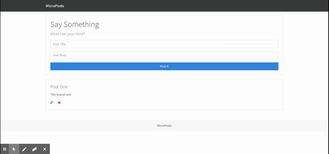

# Micro-Post

## How to use
Fork the repository, open up two git bash terminals. In one, enter the command 'npm run json:server'. In two, enter 'npm start'. 

## Languages Used
- HTML
- JavaScript
- CSS

## GIF
